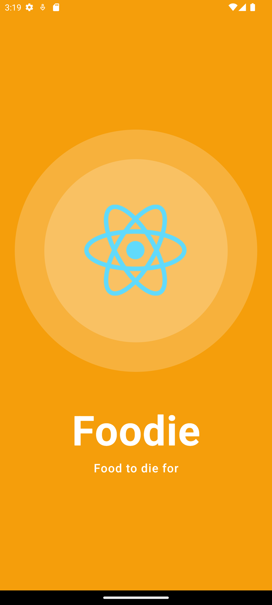
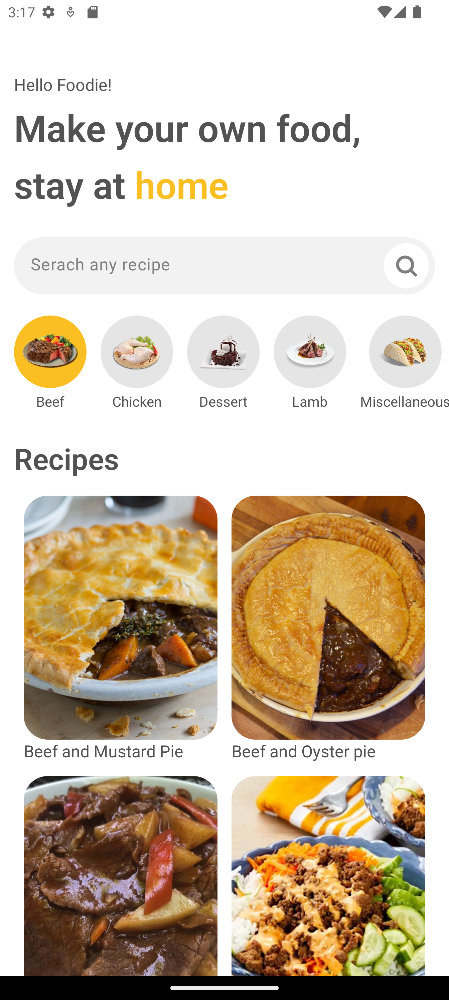
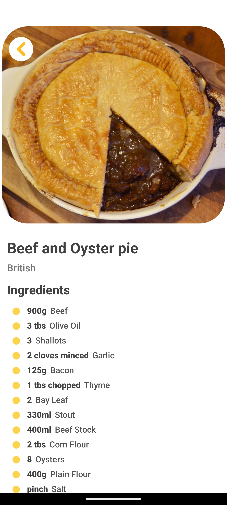
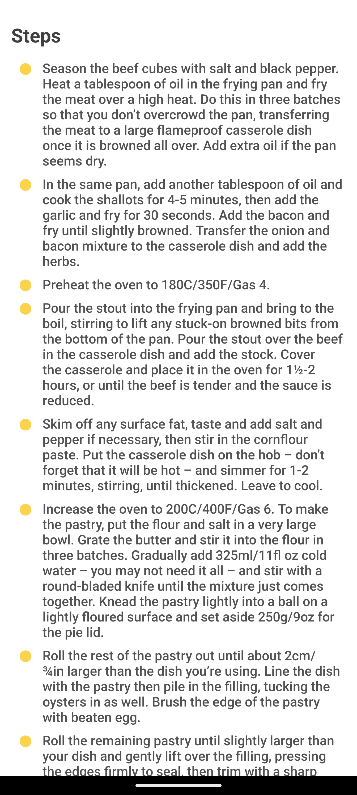

# Chatty

Foodie is a React Native application that allows users to search for and display recipes with categorization.
It uses the Meal DB API to fetch recipe data and includes YouTube videos to demonstrate the preparation of the recipes.

## Screenshots

<p align="middle">
   <h2>Splash screen</h2>
   
   
   <br />
   
   <h2>Home screen</h2>
   
   
   <br />

   <h2>Recipe screen</h2>
   
   
   
</p>

## Features

- **Search recipes**: Find recipes by name.
- **Categorization**: Browse recipes by categories such as Breakfast, Lunch, Dinner, Dessert, etc.
- **Recipe Details**: View detailed information about each recipe including ingredients, instructions, and preparation time.
- **YouTube Videos**: Watch YouTube videos related to the recipe directly within the app.

## Installation

1. Clone the repository:

   ```sh
   git clone https://github.com/rkonde/Foodie
   cd Foodie
   ```

2. Install dependencies:

   ```sh
   npm install
   ```

3. Run the app:

   ```sh
   npm start
   ```
